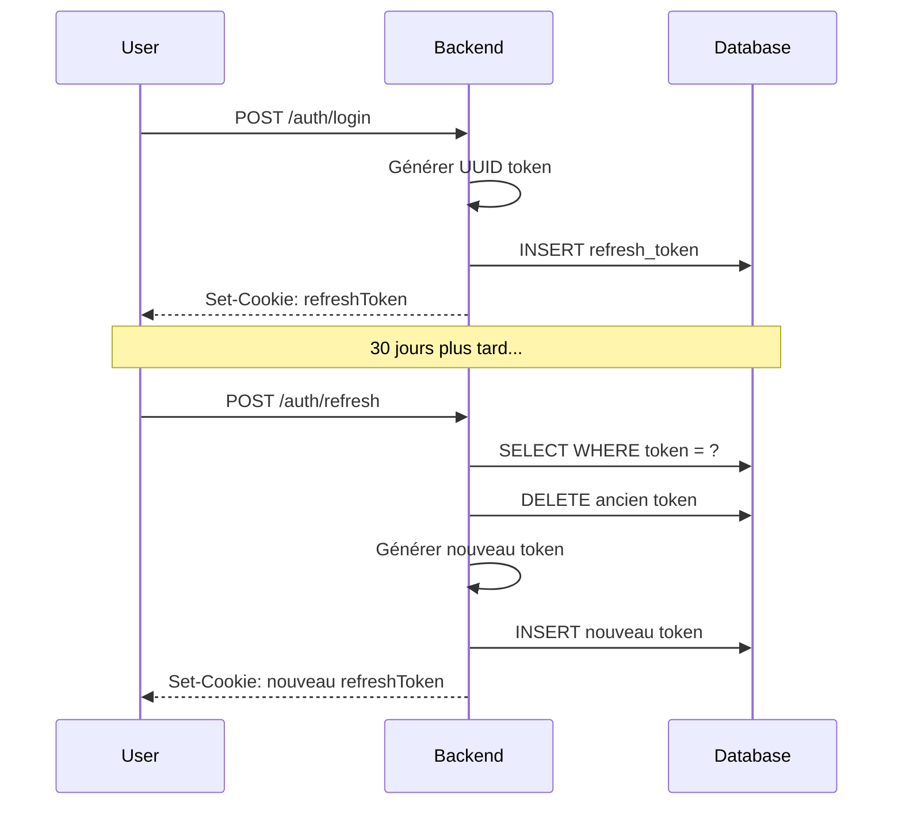

# Modèle RefreshToken

Le modèle `RefreshToken` stocke les tokens de rafraîchissement pour l'authentification.

## Schéma Prisma

```prisma
model RefreshToken {
  id       Int      @id @default(autoincrement())
  token    String   @unique
  user     User     @relation(fields: [userId], references: [id], onDelete: Cascade)
  userId   Int      @map("user_id")
  expireAt DateTime @map("expire_at")
  issuedAt DateTime @default(now()) @map("issued_at")

  @@index([userId])
  @@map("refresh_token")
}
```

## Champs

| Champ | Type | Nullable | Description |
|-------|------|----------|-------------|
| `id` | Int | Non | Identifiant unique |
| `token` | String | Non | Token unique (UUID) |
| `userId` | Int | Non | FK vers User |
| `expireAt` | DateTime | Non | Date d'expiration |
| `issuedAt` | DateTime | Non | Date d'émission |

## Relations

| Relation | Type | Modèle cible | Description |
|----------|------|--------------|-------------|
| `user` | N:1 | [User](./user.md) | Utilisateur propriétaire |

## Contraintes

- `token` : Unique
- Index sur `userId` pour les lookups rapides

## Table SQL

```sql
CREATE TABLE "refresh_token" (
  id SERIAL PRIMARY KEY,
  token VARCHAR UNIQUE NOT NULL,
  user_id INTEGER NOT NULL REFERENCES "user"(id) ON DELETE CASCADE,
  expire_at TIMESTAMP NOT NULL,
  issued_at TIMESTAMP DEFAULT NOW()
);

CREATE INDEX idx_refresh_token_user_id ON refresh_token(user_id);
```

## Cycle de vie



## Exemples

### Créer un token

```typescript
import { randomUUID } from 'crypto';

const refreshToken = await prisma.refreshToken.create({
  data: {
    token: randomUUID(),
    userId: user.id,
    expireAt: new Date(Date.now() + 30 * 24 * 60 * 60 * 1000) // 30 jours
  }
});
```

### Valider un token

```typescript
const storedToken = await prisma.refreshToken.findUnique({
  where: { token: tokenFromCookie },
  include: { user: true }
});

if (!storedToken || storedToken.expireAt < new Date()) {
  throw new UnauthorizedError('Invalid refresh token');
}
```

### Rotation de token (refresh)

```typescript
// Transaction pour éviter les race conditions
const [_, newToken] = await prisma.$transaction([
  prisma.refreshToken.delete({ where: { token: oldToken } }),
  prisma.refreshToken.create({
    data: {
      token: randomUUID(),
      userId: userId,
      expireAt: new Date(Date.now() + 30 * 24 * 60 * 60 * 1000)
    }
  })
]);
```

### Supprimer à la déconnexion

```typescript
await prisma.refreshToken.deleteMany({
  where: { token: tokenFromCookie }
});
```

### Révoquer tous les tokens d'un utilisateur

```typescript
// Utile en cas de changement de mot de passe
await prisma.refreshToken.deleteMany({
  where: { userId: user.id }
});
```

## Sécurité

| Mesure | Description |
|--------|-------------|
| UUID v4 | Token non prévisible |
| Rotation | Nouveau token à chaque refresh |
| Expiration | 30 jours max |
| Cascade delete | Supprimé si l'utilisateur est supprimé |

## Voir aussi

- [User](./user.md)
- [ADR-007 : JWT Authentication](../../arc42/09-decisions/007-jwt.md)
- [Exemple: Auth Flow](../../api-reference/examples/auth-flow.md)
