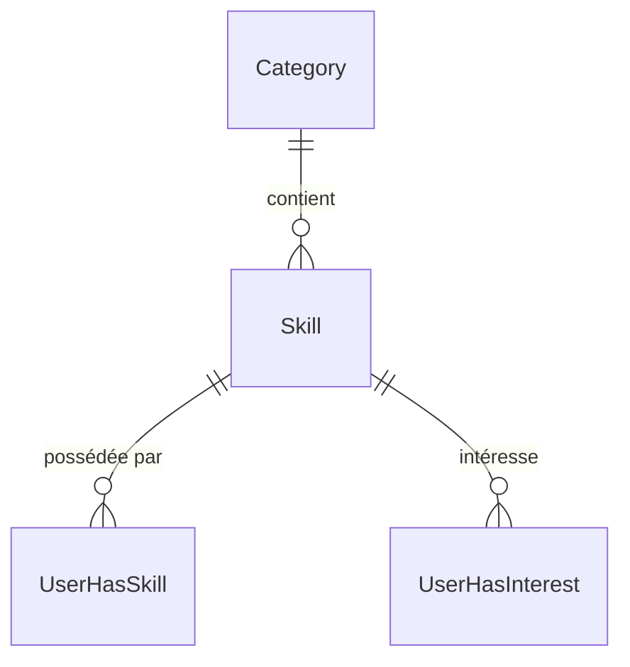

# Modèle Skill

Le modèle `Skill` représente une compétence pouvant être offerte ou recherchée par les membres.

## Schéma Prisma

```prisma
model Skill {
  id              Int               @id @default(autoincrement())
  name            String
  category        Category          @relation(fields: [categoryId], references: [id], onDelete: Cascade)
  categoryId      Int               @map("category_id")

  users           UserHasSkill[]
  interestedUsers UserHasInterest[]

  createdAt       DateTime          @default(now()) @map("created_at")
  updatedAt       DateTime          @default(now()) @updatedAt @map("updated_at")

  @@map("skill")
}
```

## Champs

| Champ | Type | Nullable | Description |
|-------|------|----------|-------------|
| `id` | Int | Non | Identifiant unique |
| `name` | String | Non | Nom de la compétence |
| `categoryId` | Int | Non | FK vers Category |
| `createdAt` | DateTime | Non | Date de création |
| `updatedAt` | DateTime | Non | Date de modification |

## Relations



| Relation | Type | Modèle cible | Description |
|----------|------|--------------|-------------|
| `category` | N:1 | [Category](./category.md) | Catégorie parente |
| `users` | N:N | [User](./user.md) via UserHasSkill | Utilisateurs qui possèdent cette compétence |
| `interestedUsers` | N:N | [User](./user.md) via UserHasInterest | Utilisateurs intéressés |

## Table SQL

```sql
CREATE TABLE "skill" (
  id SERIAL PRIMARY KEY,
  name VARCHAR NOT NULL,
  category_id INTEGER NOT NULL REFERENCES category(id) ON DELETE CASCADE,
  created_at TIMESTAMP DEFAULT NOW(),
  updated_at TIMESTAMP DEFAULT NOW()
);
```

## Exemples

### Lister les compétences d'une catégorie

```typescript
const skills = await prisma.skill.findMany({
  where: { categoryId: 2 },
  include: { category: true }
});
```

### Compétences les plus populaires

```typescript
const popularSkills = await prisma.skill.findMany({
  include: {
    _count: {
      select: { users: true }
    }
  },
  orderBy: {
    users: { _count: 'desc' }
  },
  take: 10
});
```

## Données de seed

```typescript
const skills = [
  { name: 'React', categoryId: 2 },
  { name: 'Vue.js', categoryId: 2 },
  { name: 'Node.js', categoryId: 2 },
  { name: 'Piano', categoryId: 4 },
  { name: 'Guitare', categoryId: 4 },
  { name: 'Anglais', categoryId: 1 },
  { name: 'Espagnol', categoryId: 1 }
];
```

## Voir aussi

- [Category](./category.md)
- [User](./user.md)
