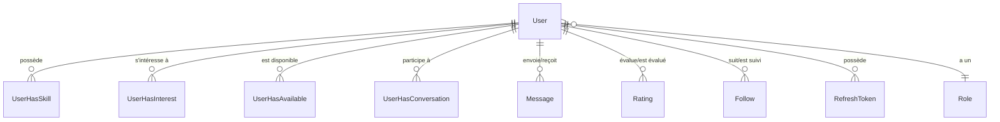

# Modèle User

Le modèle `User` représente un membre de la plateforme SkillSwap.

## Schéma Prisma

```prisma
model User {
  id           Int       @id @default(autoincrement())
  firstname    String
  lastname     String
  email        String    @unique
  password     String
  address      String?
  postalCode   Int?      @map("postal_code")
  city         String?
  age          Int?
  avatarUrl    String?   @map("avatar_url")
  description  String?

  role         Role      @relation(fields: [roleId], references: [id], onDelete: Cascade)
  roleId       Int       @map("role_id")

  skills       UserHasSkill[]
  conversations UserHasConversation[]
  availabilities UserHasAvailable[]
  refreshTokens RefreshToken[]
  interests    UserHasInterest[]

  evaluationsReceived Rating[]   @relation("EvaluatedUser")
  evaluationsGiven    Rating[]   @relation("EvaluatorUser")
  followedUsers       Follow[]   @relation("FollowedUser")
  followerUsers       Follow[]   @relation("FollowerUser")
  senderMessages      Message[]  @relation("SenderUser")
  receiverMessages    Message[]  @relation("ReceiverUser")

  createdAt    DateTime  @default(now()) @map("created_at")
  updatedAt    DateTime  @default(now()) @updatedAt @map("updated_at")

  @@map("user")
}
```

## Champs

| Champ | Type | Nullable | Description |
|-------|------|----------|-------------|
| `id` | Int | Non | Identifiant unique auto-incrémenté |
| `firstname` | String | Non | Prénom |
| `lastname` | String | Non | Nom de famille |
| `email` | String | Non | Email unique (login) |
| `password` | String | Non | Hash bcrypt du mot de passe |
| `address` | String | Oui | Adresse postale |
| `postalCode` | Int | Oui | Code postal |
| `city` | String | Oui | Ville |
| `age` | Int | Oui | Âge |
| `avatarUrl` | String | Oui | URL de la photo de profil |
| `description` | String | Oui | Bio/description |
| `roleId` | Int | Non | FK vers Role |
| `createdAt` | DateTime | Non | Date de création |
| `updatedAt` | DateTime | Non | Date de dernière modification |

## Relations



| Relation | Type | Modèle cible | Description |
|----------|------|--------------|-------------|
| `role` | N:1 | [Role](./role.md) | Rôle de l'utilisateur |
| `skills` | N:N | [Skill](./skill.md) via UserHasSkill | Compétences offertes |
| `interests` | N:N | [Skill](./skill.md) via UserHasInterest | Compétences recherchées |
| `availabilities` | N:N | [Available](./available.md) via UserHasAvailable | Créneaux disponibles |
| `conversations` | N:N | [Conversation](./conversation.md) via UserHasConversation | Conversations |
| `evaluationsReceived` | 1:N | [Rating](./rating.md) | Notes reçues |
| `evaluationsGiven` | 1:N | [Rating](./rating.md) | Notes données |
| `followedUsers` | 1:N | [Follow](./follow.md) | Utilisateurs suivis |
| `followerUsers` | 1:N | [Follow](./follow.md) | Abonnés |
| `senderMessages` | 1:N | [Message](./message.md) | Messages envoyés |
| `receiverMessages` | 1:N | [Message](./message.md) | Messages reçus |
| `refreshTokens` | 1:N | [RefreshToken](./refresh-token.md) | Tokens de refresh |

## Contraintes

- `email` : Unique
- `roleId` : FK avec cascade delete

## Index

- Index primaire sur `id`
- Index unique sur `email`

## Table SQL

```sql
CREATE TABLE "user" (
  id SERIAL PRIMARY KEY,
  firstname VARCHAR NOT NULL,
  lastname VARCHAR NOT NULL,
  email VARCHAR UNIQUE NOT NULL,
  password VARCHAR NOT NULL,
  address VARCHAR,
  postal_code INTEGER,
  city VARCHAR,
  age INTEGER,
  avatar_url VARCHAR,
  description TEXT,
  role_id INTEGER NOT NULL REFERENCES role(id) ON DELETE CASCADE,
  created_at TIMESTAMP DEFAULT NOW(),
  updated_at TIMESTAMP DEFAULT NOW()
);
```

## Exemples d'utilisation

### Créer un utilisateur

```typescript
const user = await prisma.user.create({
  data: {
    firstname: 'Marie',
    lastname: 'Dupont',
    email: 'marie@example.com',
    password: hashedPassword,
    roleId: 1
  }
});
```

### Récupérer avec relations

```typescript
const user = await prisma.user.findUnique({
  where: { id: 42 },
  include: {
    skills: {
      include: { skill: { include: { category: true } } }
    },
    interests: {
      include: { skill: true }
    },
    availabilities: {
      include: { available: true }
    }
  }
});
```

### Mettre à jour le profil

```typescript
const updated = await prisma.user.update({
  where: { id: userId },
  data: {
    city: 'Paris',
    description: 'Développeuse passionnée'
  }
});
```

## Validation Zod

Voir [ADR-005 : Zod Validation](../../arc42/09-decisions/005-zod.md) pour les schémas de validation.

```typescript
// validation/auth.validation.ts
export const registerSchema = z.object({
  email: z.email(),
  password: z.string().min(8),
  firstname: z.string().min(1),
  lastname: z.string().min(1)
});
```

## Voir aussi

- [Relations](../relations.md)
- [ADR-003 : Prisma ORM](../../arc42/09-decisions/003-prisma.md)
