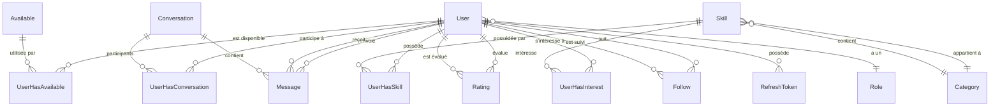

# Relations de la base de données

Ce document décrit toutes les relations entre les modèles Prisma de SkillSwap.

## Diagramme global



## Types de relations

### Relations 1:N (One-to-Many)

| Parent | Enfant | Description |
|--------|--------|-------------|
| Role | User | Un rôle → plusieurs utilisateurs |
| Category | Skill | Une catégorie → plusieurs compétences |
| Conversation | Message | Une conversation → plusieurs messages |
| User | RefreshToken | Un utilisateur → plusieurs tokens |

### Relations N:N (Many-to-Many)

Implémentées via des tables de jonction :

| Modèle A | Table de jonction | Modèle B |
|----------|-------------------|----------|
| User | `user_has_skill` | Skill |
| User | `user_has_interest` | Skill |
| User | `user_has_available` | Available |
| User | `user_has_conversation` | Conversation |

### Relations auto-référentielles

| Modèle | Relation | Description |
|--------|----------|-------------|
| User | Follow | Un utilisateur suit d'autres utilisateurs |
| User | Rating | Un utilisateur évalue d'autres utilisateurs |

## Détail des relations User

```typescript
model User {
  // Relation N:1
  role         Role      @relation(fields: [roleId], references: [id])
  roleId       Int

  // Relations N:N via tables de jonction
  skills       UserHasSkill[]
  interests    UserHasInterest[]
  availabilities UserHasAvailable[]
  conversations UserHasConversation[]

  // Relations 1:N
  refreshTokens RefreshToken[]

  // Relations auto-référentielles
  evaluationsReceived Rating[]   @relation("EvaluatedUser")
  evaluationsGiven    Rating[]   @relation("EvaluatorUser")
  followedUsers       Follow[]   @relation("FollowedUser")
  followerUsers       Follow[]   @relation("FollowerUser")
  senderMessages      Message[]  @relation("SenderUser")
  receiverMessages    Message[]  @relation("ReceiverUser")
}
```

## Cascade Delete

Toutes les relations utilisent `onDelete: Cascade` :

| Parent supprimé | Enfants supprimés |
|-----------------|-------------------|
| User | Skills, Interests, Availabilities, Conversations (participation), Messages, Ratings, Follows, RefreshTokens |
| Category | Skills |
| Conversation | Messages, Participations |
| Skill | UserHasSkill, UserHasInterest |

## Requêtes avec relations

### Include (eager loading)

```typescript
const user = await prisma.user.findUnique({
  where: { id: 1 },
  include: {
    skills: {
      include: {
        skill: {
          include: { category: true }
        }
      }
    },
    interests: {
      include: { skill: true }
    }
  }
});
```

### Select (champs spécifiques)

```typescript
const user = await prisma.user.findUnique({
  where: { id: 1 },
  select: {
    id: true,
    firstname: true,
    skills: {
      select: {
        skill: {
          select: { id: true, name: true }
        }
      }
    }
  }
});
```

### Filtrer par relation

```typescript
// Utilisateurs qui ont au moins une compétence dans la catégorie 2
const users = await prisma.user.findMany({
  where: {
    skills: {
      some: {
        skill: {
          categoryId: 2
        }
      }
    }
  }
});
```

### Compter les relations

```typescript
const user = await prisma.user.findUnique({
  where: { id: 1 },
  include: {
    _count: {
      select: {
        skills: true,
        interests: true,
        followerUsers: true,
        followedUsers: true
      }
    }
  }
});
// user._count.skills = 5
```

## Contraintes d'unicité

| Table | Contrainte |
|-------|------------|
| `user` | `email` unique |
| `category` | `slug` unique |
| `refresh_token` | `token` unique |
| `follow` | `(followedId, followerId)` unique |
| `evaluation` | `(evaluatorId, evaluatedId)` unique |

## Voir aussi

- [Modèles](./models/user.md)
- [Enums](./enums.md)
- [ADR-003 : Prisma ORM](../arc42/09-decisions/003-prisma.md)
