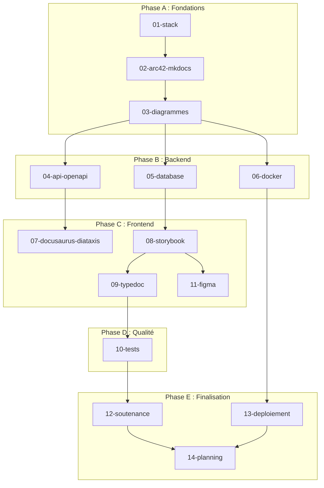

# Plan d'Action Global - Documentation SkillSwap

[← Retour au README](./README.md)

---

## 📊 État d'avancement

> **Dernière mise à jour** : 23 janvier 2025

| Phase | Statut | Progression |
|-------|--------|-------------|
| **Phase A : Fondations** | ✅ Terminée | 100% |
| **Phase B : Backend** | ✅ Terminée | 100% |
| **Phase C : Frontend** | ✅ Terminée | 100% |
| **Phase D : Qualité** | ✅ Terminée | 100% |
| **Phase E : Finalisation** | ⏳ En cours | 50% |

### Résumé des livrables

| Livrable | Statut | Notes |
|----------|--------|-------|
| MkDocs configuré | ✅ | Site fonctionnel sur localhost:8000 |
| Arc42 (12 sections) | ✅ | 32 fichiers en sous-dossiers hiérarchiques |
| ADRs (9 décisions) | ✅ | 9 fichiers individuels dans `arc42/09-decisions/` |
| OpenAPI/Swagger | ✅ | 31 endpoints documentés, validation réussie |
| Documentation BDD | ✅ | 14 modèles, ERD, relations, enums |
| Infrastructure Docker | ✅ | Services, réseaux, volumes documentés |
| Frontend (composants) | ✅ | 57 composants, 10 hooks dans `arc42/05-building-blocks/` |
| Storybook | ✅ | 90% - 15 atoms, 9 molecules, 4 organisms (170 stories) |
| Tests Vitest | ✅ | 28 tests unitaires (utils, validation) avec pattern AAA |
| Tests E2E Playwright | ✅ | 11 tests (auth.spec.ts, search.spec.ts) |
| TypeDoc | ✅ | 10 hooks, 9 fichiers lib, intégré dans MkDocs |
| Docusaurus | ✅ | 16 articles Diataxis (4 tutorials, 6 how-to, 3 explanation, 3 reference) |
| Fiches soutenance | ⏳ | Non démarré (contenu préparé dans 12-soutenance.md)

### Restructuration Arc42 (22 janvier 2025)

| Section | Fichiers éclatés |
|---------|------------------|
| 05-building-blocks | `index.md`, `frontend.md`, `backend.md`, `database.md` |
| 06-runtime | `index.md`, `authentication.md`, `search.md`, `messaging.md`, `error-handling.md` |
| 08-crosscutting | `index.md`, `authentication.md`, `validation.md`, `error-handling.md`, `logging.md`, `security.md`, `i18n.md` |
| 09-decisions | `index.md` + 9 ADRs (001 à 009) |
| 10-quality | `index.md`, `scenarios.md`, `testing.md`, `accessibility.md`, `monitoring.md` |

---

## Vue d'ensemble

Ce document définit la stratégie globale pour implémenter la documentation complète de SkillSwap dans `/docs/docs/`.

### Objectifs

- Documenter l'architecture technique (Arc42)
- Fournir une référence API interactive (OpenAPI/Swagger)
- Créer un catalogue de composants (Storybook)
- Établir une documentation utilisateur (Docusaurus)
- Préparer la soutenance avec des fiches synthétiques

### Livrables finaux (3 déploiements Vercel)

| Livrable | URL cible | Contenu |
| -------- | --------- | ------- |
| Doc technique | docs.skillswap.vercel.app | Arc42, API, BDD, TypeDoc (intégré) |
| Doc utilisateur | guide.skillswap.vercel.app | Docusaurus - Tutoriels, How-to, FAQ (Diataxis) |
| Storybook | storybook.skillswap.vercel.app | Catalogue composants (170 stories) |
| Fiches soutenance | Local | 6 fiches + Q&R jury |

---

## Diagramme de dépendances



---

## Phases du projet

### Phase A : Fondations (J1-J3)

**Objectif** : Mettre en place l'infrastructure de documentation

| Jour | Fichier | Livrables |
| ---- | ------- | --------- |
| J1 | 01-stack | Validation des choix d'outils |
| J1-J2 | 02-arc42-mkdocs | MkDocs configuré, structure Arc42 créée |
| J2-J3 | 03-diagrammes | Workspace Structurizr, 3 diagrammes C4 |

**Critères de validation Phase A** :

- [x] `mkdocs serve` fonctionne localement
- [x] Structure Arc42 (12 dossiers) créée
- [x] Diagramme C4 Context visible dans la doc

---

### Phase B : Documentation Backend (J4-J7)

**Objectif** : Documenter l'API, la BDD et l'infrastructure

| Jour | Fichier | Livrables |
| ---- | ------- | --------- |
| J4-J5 | 04-api-openapi | openapi.yaml complet (31 endpoints), Swagger UI |
| J5-J6 | 05-database | ERD généré, 14 modèles documentés, SchemaSpy |
| J6-J7 | 06-docker | Diagramme docker-compose, section Arc42 §7 |

**Critères de validation Phase B** :

- [x] Swagger UI accessible avec tous les endpoints
- [x] ERD visible dans la documentation
- [x] Architecture Docker documentée

---

### Phase C : Documentation Frontend (J8-J14)

**Objectif** : Documenter l'UI, les composants et le code

| Jour | Fichier | Livrables |
| ---- | ------- | --------- |
| J8-J9 | 07-docusaurus-diataxis | Site Docusaurus, structure Diataxis |
| J10-J12 | 08-storybook | 15 atoms + 6 molecules + 4 organisms documentés |
| J13 | 09-typedoc | TSDoc sur hooks/utils (~25 fichiers) |
| J14 | 11-figma | Tokens exportés, lien Figma ↔ Storybook |

**Critères de validation Phase C** :

- [x] Docusaurus avec 4 sections Diataxis (16 articles)
- [x] Storybook avec 170 stories (objectif: 25) ✅
- [x] TypeDoc généré et intégré à MkDocs

---

### Phase D : Qualité (J15-J18) ✅ TERMINÉE

**Objectif** : Tests et validation

| Jour | Fichier | Livrables | Statut |
| ---- | ------- | --------- | ------ |
| J15-J16 | 10-tests | Vitest configuré, 28 tests unitaires | ✅ |
| J17 | 08-storybook | Storybook 90% (170 stories) | ✅ |
| J18 | 10-tests | Playwright E2E (11 tests auth + search) | ✅ |

**Critères de validation Phase D** :

- [x] Tests unitaires Vitest : 28 tests (utils, validation) avec pattern AAA
- [x] Tests E2E Playwright : 11 tests (auth.spec.ts, search.spec.ts)
- [x] Storybook : 170 stories (15 atoms, 9 molecules, 4 organisms)
- [ ] CI/CD configuré (GitHub Actions) - optionnel

---

### Phase E : Finalisation (J19-J21)

**Objectif** : Soutenance et déploiement

| Jour | Fichier | Livrables |
| ---- | ------- | --------- |
| J19 | 09-typedoc | TypeDoc configuré et intégré à MkDocs |
| J19 | 07-docusaurus | Docusaurus avec structure Diataxis |
| J20 | 12-soutenance | 6 fiches techniques + Q&R jury (20 questions) |
| J21 | 13-deploiement | 3 URLs Vercel live (docs, guide, storybook) |

**Critères de validation Phase E** :

- [x] TypeDoc intégré à MkDocs
- [x] Docusaurus avec Tutorials, How-to, Explanation, Reference (16 articles)
- [ ] 6 fiches soutenance + Q&R jury
- [ ] 3 URLs Vercel accessibles publiquement

---

## Ordre d'implémentation optimal

```plaintext
Semaine 1 : Fondations + Backend
─────────────────────────────────
J1  → 01-stack (validation)
J1  → 02-arc42-mkdocs (setup MkDocs)
J2  → 02-arc42-mkdocs (sections 1-4)
J3  → 03-diagrammes (C4 Context + Container)
J4  → 04-api-openapi (endpoints auth, profiles)
J5  → 04-api-openapi (endpoints conv, follows) + 05-database (ERD)
J6  → 05-database (modèles) + 06-docker
J7  → 06-docker + Buffer/Review

Semaine 2 : Frontend
─────────────────────────────────
J8  → 07-docusaurus-diataxis (setup)
J9  → 07-docusaurus-diataxis (tutorials)
J10 → 08-storybook (setup + atoms)
J11 → 08-storybook (molecules)
J12 → 08-storybook (organisms)
J13 → 09-typedoc (hooks P1)
J14 → 09-typedoc (utils) + 11-figma

Semaine 3 : Qualité + Finalisation
─────────────────────────────────
J15 → 10-tests (Vitest setup + hooks)
J16 → 10-tests (composants)
J17 → 10-tests (Playwright setup)
J18 → 10-tests (E2E parcours)
J19 → 12-soutenance (fiches 1-3)
J20 → 12-soutenance (fiches 4-6 + Q&R)
J21 → 13-deploiement (4 URLs live)
```

---

## Ressources nécessaires

### Outils à installer

| Phase | Outils | Commande |
| ----- | ------ | -------- |
| A | MkDocs Material | `pip install mkdocs-material` |
| A | Structurizr CLI | `brew install structurizr-cli` |
| B | Swagger UI plugin | `pip install mkdocs-swagger-ui-tag` |
| B | SchemaSpy | Docker image |
| C | Docusaurus | `npx create-docusaurus@latest` |
| C | Storybook | `npx storybook@latest init` |
| C | TypeDoc | `npm install -D typedoc` |
| D | Vitest | `npm install -D vitest` |
| D | Playwright | `npm install -D @playwright/test` |

### Accès requis

- [ ] Vercel (3 projets : docs, guide, storybook)
- [ ] GitHub Actions (secrets configurés) - optionnel

---

## Risques et mitigations

| Risque | Impact | Probabilité | Mitigation |
| ------ | ------ | ----------- | ---------- |
| Retard Phase A | Bloque tout | Moyenne | Prioriser MkDocs minimal |
| API change pendant doc | Rework | Haute | Documenter après feature freeze |
| Storybook trop long | Retard Phase C | Moyenne | Limiter aux composants P1 |
| Tests flaky | CI instable | Moyenne | Retry + tests isolés |

---

## Métriques de succès

| Métrique | Objectif | Actuel | Statut |
| -------- | -------- | ------ | ------ |
| Couverture Arc42 | 12/12 sections | 12/12 | ✅ |
| Endpoints documentés | 31/31 | 31/31 | ✅ |
| Composants Storybook | 25+ stories | 170 stories | ✅ |
| Tests unitaires | ~14 tests | 28 tests | ✅ |
| Tests E2E | 4 parcours | 11 tests | ✅ |
| URLs live | 3/3 | 0/3 | ⏳ Phase E |

---

## Checkpoints de revue

| Checkpoint | Jour | Validation |
| ---------- | ---- | ---------- |
| **CP1** | J7 | Backend documenté, API + BDD OK |
| **CP2** | J14 | Frontend documenté, Storybook + TypeDoc OK |
| **CP3** | J18 | Tests green, CI/CD OK |
| **CP4** | J21 | Tout déployé, prêt soutenance |

---

## Navigation

| Précédent | Suivant |
| --------- | ------- |
| [README](./README.md) | [01-stack](./01-stack.md) |

---

*Dernière mise à jour : 23 janvier 2025*
