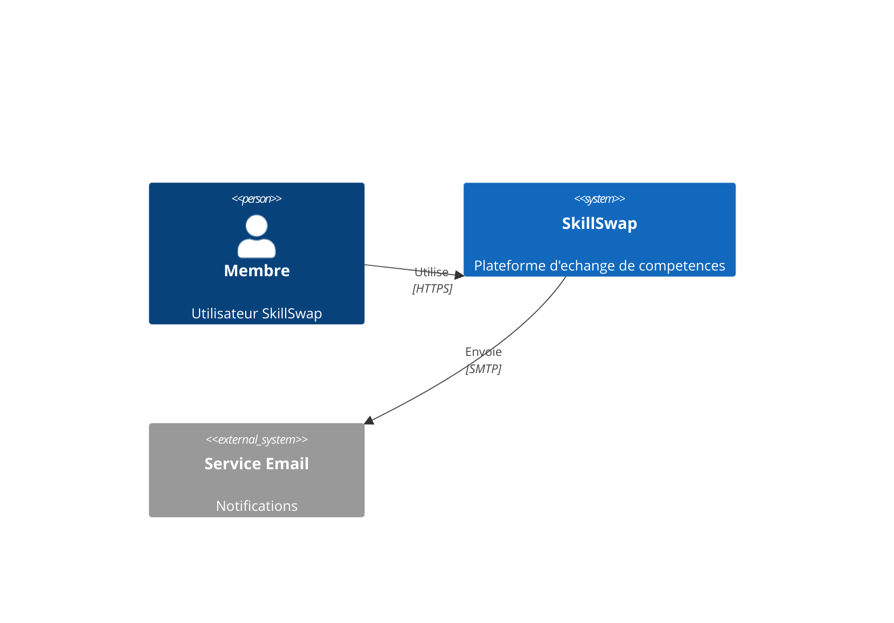
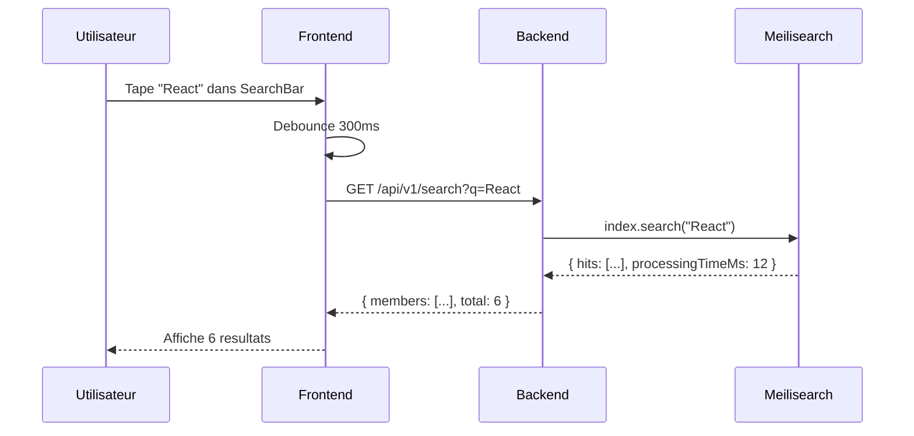

# Diagrammes as Code

[← Retour au README](./README.md)

---

## 📊 État d'avancement

> **Dernière mise à jour** : 22 janvier 2025

| Livrable | Statut | Notes |
|----------|--------|-------|
| C4 Context (§3) | ✅ Terminé | Intégré dans arc42/03-context.md |
| C4 Container (§5) | ✅ Terminé | Intégré dans arc42/05-building-blocks.md |
| Diagrammes séquence (§6) | ✅ Terminé | Auth, Search, Messaging dans arc42/06-runtime-view.md |
| Mermaid dans MkDocs | ✅ Terminé | Rendu OK |

**Progression globale** : ✅ **100%**

---

## Objectif

Créer les diagrammes d'architecture pour SkillSwap afin de :

- Visualiser l'architecture système (C4 Model)
- Documenter les flux d'exécution (séquences)
- Intégrer les diagrammes dans Arc42 (sections 3, 5, 6, 7)

---

## Pourquoi Structurizr + Mermaid

| Outil | Role | Avantage |
| ----- | ---- | -------- |
| **Structurizr** | Source unique C4 | Workspace centralise, pas de redondance |
| **Mermaid** | Rendu dans Markdown | Natif GitHub/MkDocs, pas de serveur |

---

## Workflow

```plaintext
1. Definir architecture dans Structurizr DSL (workspace.dsl)
          ↓
2. Exporter en Mermaid ou PlantUML
          ↓
3. Integrer dans les fichiers Markdown Arc42
          ↓
4. MkDocs genere le site avec diagrammes
```

---

## Diagrammes à créer

### Inventaire C4 Model

| Niveau | Diagramme | Section Arc42 | Description |
| ------ | --------- | ------------- | ----------- |
| **C4 Level 1** | System Context | §3 Context | SkillSwap dans son environnement |
| **C4 Level 2** | Container | §5 Building Blocks | Frontend, Backend, BDD, Meilisearch |
| **C4 Level 3** | Component (Frontend) | §5 Building Blocks | Atomic Design structure |
| **C4 Level 3** | Component (Backend) | §5 Building Blocks | Routes, Controllers, Services |

### Inventaire Séquences

| Flux | Section Arc42 | Participants |
| ---- | ------------- | ------------ |
| **Authentification** | §6 Runtime | User → Frontend → Backend → BDD |
| **Recherche** | §6 Runtime | User → Frontend → Backend → Meilisearch |
| **Messagerie** | §6 Runtime | User → Frontend → Backend → BDD |

### Inventaire Déploiement

| Diagramme | Section Arc42 | Description |
| --------- | ------------- | ----------- |
| **Docker Architecture** | §7 Deployment | Containers et réseaux |

---

## Exemple Structurizr DSL

```dsl
workspace "SkillSwap" "Plateforme d'echange de competences" {

    model {
        # Acteurs
        user = person "Membre" "Utilisateur inscrit sur SkillSwap"

        # Systeme principal
        skillswap = softwareSystem "SkillSwap" "Plateforme d'echange" {
            frontend = container "Frontend" "Interface utilisateur" "Next.js 15, React 19" "Web App"
            backend = container "Backend" "API REST" "Express.js, Node 20" "API"
            database = container "PostgreSQL" "Stockage donnees" "PostgreSQL 16" "Database"
            search = container "Meilisearch" "Moteur de recherche" "Meilisearch 1.6" "Search Engine"
            cache = container "Redis" "Cache sessions" "Redis 7" "Cache"
        }

        # Relations
        user -> frontend "Utilise" "HTTPS"
        frontend -> backend "Appelle" "REST/JSON"
        backend -> database "Lit/Ecrit" "Prisma ORM"
        backend -> search "Recherche" "HTTP"
        backend -> cache "Cache" "Redis Protocol"
    }

    views {
        systemContext skillswap "Context" {
            include *
            autoLayout
        }

        container skillswap "Containers" {
            include *
            autoLayout
        }

        theme default
    }
}
```

---

## Exemples Mermaid pour Arc42

### C4 Context (Section 3)



### Sequence - Recherche (Section 6)



---

## Plan d'action détaillé

### Phase 1 : Setup Structurizr (J2-J3 matin - 2h)

| Étape | Action | Livrable | Validation |
| ----- | ------ | -------- | ---------- |
| 1.1 | Installer Structurizr CLI | CLI disponible | `structurizr-cli --version` |
| 1.2 | Créer `workspace.dsl` | Fichier DSL | Syntaxe valide |
| 1.3 | Définir modèle (actors, systems, containers) | Model complet | Export OK |

### Phase 2 : Diagrammes C4 (J3 - 3h)

| Étape | Action | Livrable | Validation |
| ----- | ------ | -------- | ---------- |
| 2.1 | Créer C4 Context | Mermaid dans §3 | Rendu OK |
| 2.2 | Créer C4 Container | Mermaid dans §5 | 5 containers visibles |
| 2.3 | Créer C4 Component Frontend | Mermaid dans §5 | Atomic layers |
| 2.4 | Créer C4 Component Backend | Mermaid dans §5 | Routes/Controllers |

### Phase 3 : Diagrammes Séquence (J3 - 2h)

| Étape | Action | Livrable | Validation |
| ----- | ------ | -------- | ---------- |
| 3.1 | Créer séquence Auth | Mermaid dans §6 | Login flow complet |
| 3.2 | Créer séquence Search | Mermaid dans §6 | Debounce visible |
| 3.3 | Créer séquence Messaging | Mermaid dans §6 | Envoi message |

### Phase 4 : Intégration Arc42 (J3 - 1h)

| Étape | Action | Livrable | Validation |
| ----- | ------ | -------- | ---------- |
| 4.1 | Intégrer dans arc42/03-context.md | Diagramme visible | Rendu MkDocs |
| 4.2 | Intégrer dans arc42/05-building-blocks.md | 3 diagrammes | Rendu MkDocs |
| 4.3 | Intégrer dans arc42/06-runtime-view.md | 3 séquences | Rendu MkDocs |

---

## Dépendances

### Requiert (inputs)

| Dépendance | Fichier source | Statut |
| ---------- | -------------- | ------ |
| MkDocs configuré | 02-arc42-mkdocs.md | Phase A |
| Architecture connue | Codebase existant | ✅ Existant |

### Bloque (outputs)

| Fichier dépendant | Raison |
| ----------------- | ------ |
| 02-arc42-mkdocs | Sections §3, §5, §6 nécessitent diagrammes |
| 12-soutenance | Fiches incluent diagrammes |

---

## Critères de validation

### Obligatoires (must-have)

- [x] C4 Context créé et intégré dans Arc42 §3
- [x] C4 Container créé et intégré dans Arc42 §5
- [x] 3 diagrammes séquence créés et intégrés dans Arc42 §6
- [x] Tous les diagrammes rendus correctement dans MkDocs

### Optionnels (nice-to-have)

- [ ] C4 Component (Frontend + Backend)
- [ ] Workspace Structurizr versionné
- [ ] Export PNG/SVG pour présentations

---

## Ressources nécessaires

### Outils

```bash
# Structurizr CLI (optionnel)
brew install structurizr-cli  # macOS
# ou Docker
docker pull structurizr/cli

# Alternative : Mermaid directement dans Markdown
# Pas d'installation requise, supporté par MkDocs Material
```

### Documentation

- C4 Model : <https://c4model.com/>
- Structurizr DSL : <https://structurizr.com/help/dsl>
- Mermaid : <https://mermaid.js.org/>

### Temps estimé

| Phase | Durée | Effort |
| ----- | ----- | ------ |
| Phase 1 | 2h | Setup |
| Phase 2 | 3h | C4 diagrams |
| Phase 3 | 2h | Séquences |
| Phase 4 | 1h | Intégration |
| **Total** | **8h** | ~1 jour |

---

## Risques spécifiques

| Risque | Impact | Mitigation |
| ------ | ------ | ---------- |
| Mermaid C4 non supporté | Pas de rendu | Utiliser flowchart standard |
| Diagrammes trop complexes | Illisibles | Limiter à 7±2 éléments |
| Structurizr learning curve | Retard | Fallback Mermaid direct |

---

## Fichiers à créer (checklist finale)

```plaintext
docs/docs/
├── [ ] workspace.dsl              # Source Structurizr (optionnel)
├── [ ] arc42/
│   ├── [ ] 03-context.md          # Contient C4 Context
│   ├── [ ] 05-building-blocks.md  # Contient C4 Container + Component
│   └── [ ] 06-runtime-view.md     # Contient 3 séquences
└── [ ] diagrams/                   # Export PNG/SVG (optionnel)
    ├── [ ] c4-context.svg
    ├── [ ] c4-container.svg
    └── [ ] sequence-*.svg
```

**Total** : 1 DSL + 3 sections Arc42 enrichies + exports = **7+ fichiers**

---

## Navigation

| Précédent | Suivant |
| --------- | ------- |
| [02-arc42-mkdocs](./02-arc42-mkdocs.md) | [04-api-openapi](./04-api-openapi.md) |
