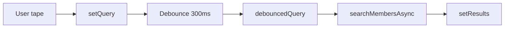

# Preparation Soutenance

[← Retour au README](./README.md)

---

## 📊 État d'avancement

> **Dernière mise à jour** : 23 janvier 2025

| Livrable | Statut | Notes |
|----------|--------|-------|
| Structure docs/soutenance/ | ⏳ Non démarré | Phase E |
| Template fiche (_template.md) | ⏳ Non démarré | Format standardisé |
| Fiche 01 - Architecture globale | ⏳ Non démarré | C4 + points clés |
| Fiche 02 - Atomic Design | ⏳ Non démarré | Arbre composants |
| Fiche 03 - useSearch hook | ⏳ Non démarré | Flowchart + code |
| Fiche 04 - Auth flow | ⏳ Non démarré | JWT séquence |
| Fiche 05 - Messaging system | ⏳ Non démarré | SSE architecture |
| Fiche 06 - Meilisearch | ⏳ Non démarré | Indexation flow |
| Q&R Jury (20+ questions) | ⏳ Non démarré | Anticipation |
| Script de démo | ⏳ Non démarré | Timing minute/minute |

**Progression globale** : ⏳ **0%** (Phase E non démarrée)

---

## Structure des fiches

```plaintext
docs/soutenance/
├── fiches/
│   ├── 01-architecture-globale.md
│   ├── 02-atomic-design.md
│   ├── 03-useSearch-hook.md
│   ├── 04-auth-flow.md
│   ├── 05-messaging-system.md
│   └── 06-meilisearch-integration.md
│
├── qr-jury.md                    # Questions/Reponses anticipees
└── demo-script.md                # Script de demonstration
```

---

## Template de fiche

````markdown
# Fiche: [Nom de la fonctionnalite]

## En une phrase
[Description en une phrase simple]

## Schema mental
[Diagramme Mermaid simple]

## Points cles (5 max)
1. ...
2. ...
3. ...

## Code essentiel (10 lignes max)
```typescript
// Le code le plus important a connaitre
```

## Question probable du jury

**Q**: "[Question]"
**R**: "[Reponse preparee]"

## Liens

- Fichier: `path/to/file.ts`
- Documentation: [Lien Arc42]
````

---

## Exemple: Fiche useSearch

````markdown
# Fiche: Hook useSearch

## En une phrase
Hook React qui gere la recherche avec debounce 300ms et une architecture
permettant une transition transparente du mock vers l'API Meilisearch.

## Schema mental


## Points cles

1. **Debounce 300ms**: Evite les requetes a chaque frappe
2. **debouncedQuery vs query**: Separe l'affichage de la recherche
3. **Reset page**: Retour page 1 quand filtres changent
4. **Transition mock/API**: Changer 2 lignes pour passer a Meilisearch
5. **AbortController**: Annule les requetes obsoletes

## Code essentiel

```typescript
// Debounce pattern
useEffect(() => {
  const timer = setTimeout(() => {
    setDebouncedQuery(query);
  }, 300);
  return () => clearTimeout(timer);
}, [query]);
```

## Question probable du jury

**Q**: "Pourquoi un debounce et pas un appel direct a l'API ?"
**R**: "Sans debounce, taper 'React' genererait 5 requetes (R, Re, Rea, Reac, React).
Avec le debounce, on attend 300ms d'inactivite avant d'envoyer une seule requete.
Cela reduit la charge serveur et ameliore l'UX."

## Liens

- Fichier: `hooks/useSearch.ts`
- Documentation: [Section 6 - Runtime View](../arc42/06-runtime/index.md)
````

---

## Inventaire des fiches à créer

### Fiches techniques (6)

| Fiche | Sujet | Diagramme | Questions anticipées |
| ----- | ----- | --------- | -------------------- |
| 01-architecture-globale | Vue C4, séparation frontend/backend | C4 Context + Container | Pourquoi Next.js ? Pourquoi Express ? |
| 02-atomic-design | Organisation composants React | Arbre atoms/molecules/organisms | Différence molecule vs organism ? |
| 03-useSearch-hook | Recherche avec debounce | Flowchart recherche | Pourquoi debounce 300ms ? |
| 04-auth-flow | JWT + refresh tokens | Séquence auth | Pourquoi pas sessions ? |
| 05-messaging-system | Architecture temps réel | Séquence messages | Pourquoi SSE vs WebSocket ? |
| 06-meilisearch-integration | Moteur de recherche | Flowchart indexation | Pourquoi pas PostgreSQL full-text ? |

### Documents de préparation (2)

| Document | Contenu | Objectif |
| -------- | ------- | -------- |
| qr-jury.md | 20+ questions/réponses | Anticiper le jury |
| demo-script.md | Script minute par minute | Démo fluide |

---

## Plan d'action détaillé

### Phase 1 : Structure et templates (J18 matin - 1h)

| Étape | Action | Livrable | Validation |
| ----- | ------ | -------- | ---------- |
| 1.1 | Créer structure `docs/soutenance/` | Dossier + sous-dossiers | `ls -la` |
| 1.2 | Créer template de fiche | `_template.md` | Format validé |
| 1.3 | Créer fichiers vides pour 6 fiches | 6 fichiers `.md` | Structure prête |
| 1.4 | Préparer liens vers Arc42/Storybook | Références listées | URLs vérifiées |

### Phase 2 : Fiches 1-3 (J18 après-midi - 3h)

| Étape | Action | Livrable | Validation |
| ----- | ------ | -------- | ---------- |
| 2.1 | Rédiger fiche Architecture globale | C4 + points clés | Diagramme intégré |
| 2.2 | Rédiger fiche Atomic Design | Arbre composants | Exemples concrets |
| 2.3 | Rédiger fiche useSearch | Flowchart + code | Question/réponse OK |
| 2.4 | Relecture croisée équipe | Corrections | Pas d'erreurs |

### Phase 3 : Fiches 4-6 (J19 matin - 3h)

| Étape | Action | Livrable | Validation |
| ----- | ------ | -------- | ---------- |
| 3.1 | Rédiger fiche Auth flow | Séquence JWT | Flow complet |
| 3.2 | Rédiger fiche Messaging | Séquence SSE | Architecture claire |
| 3.3 | Rédiger fiche Meilisearch | Flowchart indexation | Avantages expliqués |
| 3.4 | Relecture croisée équipe | Corrections | Pas d'erreurs |

### Phase 4 : Q&R Jury (J19 après-midi - 2h)

| Étape | Action | Livrable | Validation |
| ----- | ------ | -------- | ---------- |
| 4.1 | Brainstormer 30 questions possibles | Liste questions | Équipe impliquée |
| 4.2 | Rédiger 20 réponses détaillées | `qr-jury.md` | Réponses claires |
| 4.3 | Catégoriser par thème | Architecture, Code, DevOps | Organisation OK |
| 4.4 | Simuler session Q&R | Répétition orale | Réponses fluides |

### Phase 5 : Script de démo (J20 matin - 2h)

| Étape | Action | Livrable | Validation |
| ----- | ------ | -------- | ---------- |
| 5.1 | Définir parcours de démo | Liste des features | Ordre logique |
| 5.2 | Écrire script minute par minute | `demo-script.md` | Timing précis |
| 5.3 | Préparer données de test | Utilisateurs, conversations | Data réaliste |
| 5.4 | Répéter la démo 2x | Chronométrage | < 15 minutes |

### Phase 6 : Répétition générale (J20 après-midi - 2h)

| Étape | Action | Livrable | Validation |
| ----- | ------ | -------- | ---------- |
| 6.1 | Répéter présentation complète | Oral fluide | Timing respecté |
| 6.2 | Session Q&R simulée | Réponses testées | Pas de blocage |
| 6.3 | Identifier points faibles | Liste corrections | Actions définies |
| 6.4 | Corrections finales | Documents à jour | Prêt pour J-Day |

---

## Dépendances

### Requiert (inputs)

| Dépendance | Fichier source | Statut |
| ---------- | -------------- | ------ |
| Arc42 complet | 02-arc42-mkdocs.md | Phase A |
| Diagrammes C4 | 03-diagrammes.md | Phase A |
| API documentée | 04-api-openapi.md | Phase B |
| Storybook fonctionnel | 08-storybook.md | Phase C |
| TypeDoc généré | 09-typedoc.md | Phase C |
| Code source stable | frontend/backend | ✅ Existant |

### Bloque (outputs)

| Fichier dépendant | Raison |
| ----------------- | ------ |
| 14-planning.md | Dates de répétition |
| Soutenance réelle | Documentation équipe |

---

## Critères de validation

### Obligatoires (must-have)

- [ ] 6 fiches techniques complètes avec diagrammes
- [ ] 20+ questions/réponses anticipées
- [ ] Script de démo minute par minute
- [ ] Chaque membre peut présenter sa partie
- [ ] Démo testée et chronométrée (< 15 min)
- [ ] Liens vers Arc42/Storybook fonctionnels

### Optionnels (nice-to-have)

- [ ] Slides de présentation (PowerPoint/Google Slides)
- [ ] Vidéo de backup si démo échoue
- [ ] Fiches imprimées pour le jury
- [ ] Répétition devant public externe

---

## Ressources nécessaires

### Outils

```bash
# Diagrammes Mermaid (intégrés dans Markdown)
# Pas d'outil externe requis

# Export PDF (optionnel)
npm install -D md-to-pdf
npx md-to-pdf docs/soutenance/fiches/*.md

# Slides (optionnel)
# Google Slides ou Marp (Markdown to slides)
npm install -g @marp-team/marp-cli
```

### Documentation

- Arc42 : <https://docs.arc42.org/>
- Mermaid : <https://mermaid.js.org/>
- Marp (slides) : <https://marp.app/>

### Temps estimé

| Phase | Durée | Effort |
| ----- | ----- | ------ |
| Phase 1 | 1h | Structure |
| Phase 2 | 3h | Fiches 1-3 |
| Phase 3 | 3h | Fiches 4-6 |
| Phase 4 | 2h | Q&R Jury |
| Phase 5 | 2h | Script démo |
| Phase 6 | 2h | Répétition |
| **Total** | **13h** | ~2 jours |

---

## Risques spécifiques

| Risque | Impact | Mitigation |
| ------ | ------ | ---------- |
| Démo qui échoue | Présentation ratée | Vidéo de backup, mock data |
| Questions imprévues | Réponses confuses | 30 questions préparées, pas 20 |
| Timing dépassé | Jury frustré | Répéter avec chrono, couper |
| Membre absent | Partie non couverte | Chaque membre connaît 2 parties |
| Liens cassés | Professionnalisme | Vérifier tous les liens J-1 |

---

## Contrats d'interface OpenAPI

### Pourquoi en parler au jury ?

La maîtrise des **contrats d'interface OpenAPI** démontre une compréhension professionnelle de l'architecture logicielle moderne. C'est un point différenciant pour un CDA.

### Ce qu'est OpenAPI

```
┌─────────────────────────────────────────────────────────────────┐
│                    ÉCOSYSTÈME OpenAPI                           │
├─────────────────────────────────────────────────────────────────┤
│                                                                 │
│   OpenAPI = SPÉCIFICATION (format YAML/JSON standardisé)        │
│   Swagger = OUTILS (UI, Editor, Codegen)                        │
│                                                                 │
│   Analogie : OpenAPI est à Swagger ce que HTML est à Chrome     │
│                                                                 │
└─────────────────────────────────────────────────────────────────┘
```

### Le concept de contrat

Un fichier `openapi.yaml` sert de **source de vérité** entre le frontend et le backend :

```yaml
# Exemple simplifié de contrat
paths:
  /auth/login:
    post:
      summary: Connexion utilisateur
      requestBody:
        content:
          application/json:
            schema:
              type: object
              required: [email, password]
              properties:
                email:
                  type: string
                  format: email
                password:
                  type: string
      responses:
        '200':
          description: Connexion réussie
        '401':
          description: Identifiants incorrects
```

### Usages possibles d'OpenAPI

| Usage | Description | Outils |
|-------|-------------|--------|
| **Documentation** | Interface interactive pour explorer l'API | Swagger UI, Redoc |
| **Génération de types** | Types TypeScript automatiques | openapi-typescript |
| **Génération de SDK** | Client API complet | openapi-generator |
| **Validation** | Vérifier requêtes/réponses | express-openapi-validator |
| **Tests** | Tests automatisés depuis le contrat | Dredd, Schemathesis |
| **Import Postman** | Collection de tests | Postman, Insomnia |

### Ce qui est implémenté dans SkillSwap

| Élément | Statut | Fichier |
|---------|--------|---------|
| Contrat OpenAPI complet | ✅ | `api-reference/openapi.yaml` |
| Documentation Swagger UI | ✅ | `api-reference/swagger.md` |
| 35+ endpoints documentés | ✅ | Tous les endpoints de l'API |
| Schémas de données | ✅ | 25+ schemas (User, Skill, etc.) |

### Questions probables du jury

**Q1 : "Qu'est-ce qu'un contrat d'interface ?"**

> **R** : "Un contrat d'interface est une spécification formelle qui décrit comment deux systèmes communiquent. Dans notre cas, le fichier `openapi.yaml` définit exactement les endpoints disponibles, les paramètres attendus, les formats de réponse et les codes d'erreur. C'est la source de vérité partagée entre le frontend et le backend."

**Q2 : "Quelle est la différence entre Swagger et OpenAPI ?"**

> **R** : "OpenAPI est la spécification - le format standardisé pour décrire une API REST. Swagger est un ensemble d'outils qui utilisent cette spécification : Swagger UI pour la documentation interactive, Swagger Editor pour éditer le fichier, Swagger Codegen pour générer du code. C'est comme la différence entre HTML (la spec) et Chrome (l'outil)."

**Q3 : "Pourquoi utiliser un contrat plutôt que documenter dans le code ?"**

> **R** : "Le contrat OpenAPI offre plusieurs avantages :
> 1. **Standard industriel** : Compatible avec des centaines d'outils
> 2. **Indépendant du langage** : Utilisable que le backend soit en Node, Python ou Java
> 3. **Documentation vivante** : Swagger UI permet de tester directement
> 4. **Génération automatique** : Types TypeScript, SDK clients, tests"

---

## Retour d'expérience et axes d'amélioration

### Ce que nous avons appris

Cette section démontre notre **capacité de réflexion** et notre **maturité professionnelle** - exactement ce qu'attend le jury d'un CDA.

### Axe 1 : Contract-First Development

**Constat** : Nous avons documenté l'API après l'avoir développée (approche "Code-First").

**Ce qu'on ferait différemment** :

```
┌─────────────────────────────────────────────────────────────────┐
│              APPROCHE CODE-FIRST (notre projet)                 │
├─────────────────────────────────────────────────────────────────┤
│   1. Développer l'endpoint                                      │
│   2. Tester manuellement                                        │
│   3. Documenter après                                           │
│   → Risque de désynchronisation code/documentation              │
└─────────────────────────────────────────────────────────────────┘

┌─────────────────────────────────────────────────────────────────┐
│              APPROCHE CONTRACT-FIRST (idéale)                   │
├─────────────────────────────────────────────────────────────────┤
│   1. Définir le contrat OpenAPI ensemble (front + back)         │
│   2. Générer les types TypeScript automatiquement               │
│   3. Frontend et backend développent en parallèle               │
│   4. Le contrat garantit la compatibilité                       │
│   → Travail parallèle, moins de bugs d'intégration              │
└─────────────────────────────────────────────────────────────────┘
```

**Bénéfices manqués** :
- Génération automatique des types TypeScript frontend
- Validation automatique des réponses API
- Développement frontend/backend réellement parallèle
- Détection des incompatibilités au build, pas en production

### Axe 2 : Validation automatique

**Constat** : La validation Zod est manuelle côté backend.

**Amélioration possible** :

```typescript
// Avec express-openapi-validator
import { OpenApiValidator } from 'express-openapi-validator';

app.use(
  OpenApiValidator.middleware({
    apiSpec: './openapi.yaml',
    validateRequests: true,   // Valide les entrées
    validateResponses: true   // Valide les sorties
  })
);

// → Toute requête non conforme au contrat = erreur automatique
```

### Axe 3 : Génération de types partagés

**Constat** : Les types frontend et backend sont définis séparément.

**Amélioration possible** :

```bash
# Générer les types depuis le contrat
npx openapi-typescript openapi.yaml -o src/types/api.generated.ts

# → Types toujours synchronisés avec l'API
# → Erreurs TypeScript si l'API change
```

### Axe 4 : Postman structuré dès le début

**Constat** : Postman a été utilisé de manière ad-hoc pour tester les endpoints, sans structure ni automatisation.

**Ce qu'on aurait pu faire** :

```
┌─────────────────────────────────────────────────────────────────────────┐
│                    WORKFLOW POSTMAN IDÉAL                               │
├─────────────────────────────────────────────────────────────────────────┤
│                                                                         │
│   1. COLLECTIONS ORGANISÉES                                             │
│   ┌─────────────────────────────────────────────────────────────────┐   │
│   │  📁 SkillSwap API                                               │   │
│   │  ├── 📁 Auth                                                    │   │
│   │  │   ├── POST Register                                          │   │
│   │  │   ├── POST Login                                             │   │
│   │  │   ├── POST Logout                                            │   │
│   │  │   └── POST Refresh                                           │   │
│   │  ├── 📁 Profiles                                                │   │
│   │  ├── 📁 Skills                                                  │   │
│   │  ├── 📁 Conversations                                           │   │
│   │  └── 📁 Messages                                                │   │
│   └─────────────────────────────────────────────────────────────────┘   │
│                                                                         │
│   2. ENVIRONNEMENTS                                                     │
│   ┌─────────────────────────────────────────────────────────────────┐   │
│   │  🔵 Local      → baseUrl: http://localhost:3000/api/v1          │   │
│   │  🟢 Docker     → baseUrl: http://localhost:8888/api/v1          │   │
│   │  🟠 Production → baseUrl: https://api.skillswap.fr/api/v1       │   │
│   └─────────────────────────────────────────────────────────────────┘   │
│                                                                         │
│   3. VARIABLES DYNAMIQUES                                               │
│   ┌─────────────────────────────────────────────────────────────────┐   │
│   │  {{baseUrl}}/auth/login                                         │   │
│   │  Authorization: Bearer {{accessToken}}                          │   │
│   │  userId: {{currentUserId}}                                      │   │
│   └─────────────────────────────────────────────────────────────────┘   │
│                                                                         │
│   4. TESTS AUTOMATISÉS (par requête)                                    │
│   ┌─────────────────────────────────────────────────────────────────┐   │
│   │  pm.test("Status is 200", function() {                          │   │
│   │      pm.response.to.have.status(200);                           │   │
│   │  });                                                            │   │
│   │                                                                 │   │
│   │  pm.test("Response has user data", function() {                 │   │
│   │      var jsonData = pm.response.json();                         │   │
│   │      pm.expect(jsonData.data).to.have.property('id');           │   │
│   │  });                                                            │   │
│   │                                                                 │   │
│   │  // Sauvegarder le token pour les requêtes suivantes            │   │
│   │  pm.environment.set("accessToken", jsonData.accessToken);       │   │
│   └─────────────────────────────────────────────────────────────────┘   │
│                                                                         │
│   5. MOCK SERVER                                                        │
│   ┌─────────────────────────────────────────────────────────────────┐   │
│   │  → Le frontend peut coder AVANT que le backend soit prêt        │   │
│   │  → Réponses simulées basées sur les exemples de la collection   │   │
│   │  → URL temporaire : https://xxxxx.mock.pstmn.io                 │   │
│   └─────────────────────────────────────────────────────────────────┘   │
│                                                                         │
└─────────────────────────────────────────────────────────────────────────┘
```

**Bénéfices manqués** :

| Sans Postman structuré | Avec Postman structuré |
|------------------------|------------------------|
| Tests manuels répétitifs | Tests automatisés en 1 clic (Collection Runner) |
| Variables en dur | Environnements partagés (local, docker, prod) |
| "Ça marche chez moi" | Configuration identique pour toute l'équipe |
| Frontend attend le backend | Mock server → travail parallèle |
| Pas de documentation API testable | Documentation publiée avec exemples exécutables |
| Régression non détectée | Monitors pour surveiller l'API en continu |

**Exemple de script de test Postman** :

```javascript
// Tests automatiques après POST /auth/login
pm.test("Login successful", function() {
    pm.response.to.have.status(200);
});

pm.test("Response contains user data", function() {
    const response = pm.response.json();
    pm.expect(response.success).to.be.true;
    pm.expect(response.data).to.have.property('id');
    pm.expect(response.data).to.have.property('email');
});

pm.test("Cookies are set", function() {
    pm.expect(pm.cookies.has('accessToken')).to.be.true;
    pm.expect(pm.cookies.has('refreshToken')).to.be.true;
});

// Sauvegarder pour les requêtes suivantes
const response = pm.response.json();
pm.environment.set("currentUserId", response.data.id);
```

**Question probable du jury** :

**Q : "Comment avez-vous testé votre API ?"**

> **R** : "Nous avons utilisé Postman pour tester nos endpoints manuellement. Avec le recul, nous aurions dû structurer nos collections dès le début avec :
> - Des **environnements** pour basculer facilement entre local et Docker
> - Des **tests automatisés** pour valider les réponses
> - Un **mock server** pour permettre au frontend d'avancer sans attendre le backend
> - Des **variables chaînées** pour automatiser les flows (login → récupérer token → utiliser dans les requêtes suivantes)"

---

### Synergie OpenAPI + Postman

Ces deux outils sont complémentaires :

```
┌─────────────────────────────────────────────────────────────────────────┐
│                    WORKFLOW IDÉAL                                       │
├─────────────────────────────────────────────────────────────────────────┤
│                                                                         │
│   ┌──────────────┐         ┌──────────────┐         ┌──────────────┐   │
│   │   OpenAPI    │ ──────► │   Postman    │ ──────► │    Tests     │   │
│   │   (Contrat)  │ Import  │ (Collection) │ Runner  │  Automatisés │   │
│   └──────────────┘         └──────────────┘         └──────────────┘   │
│         │                        │                        │             │
│         │                        │                        │             │
│         ▼                        ▼                        ▼             │
│   Documentation            Mock Server              CI/CD Pipeline      │
│   Swagger UI               Frontend dev             Newman (CLI)        │
│                                                                         │
└─────────────────────────────────────────────────────────────────────────┘
```

**Conversion bidirectionnelle** :
- OpenAPI → Postman : `Import > OpenAPI 3.0`
- Postman → OpenAPI : `Export > OpenAPI 3.0` ou outil `postman-to-openapi`

---

### Comment présenter Storybook au jury

#### Script de démonstration (3-5 minutes)

**1. Introduction (30 secondes)**

> "Storybook est notre **catalogue de composants UI**. Il documente visuellement chaque composant de l'application, permet de les tester en isolation et garantit la cohérence du design system."

**2. Démonstration (2-3 minutes)**

```
Ordre de présentation recommandé :

1. SIDEBAR → Expliquer l'organisation Atomic Design
   "Nous avons documenté 15 Atoms, 9 Molecules et 4 Organisms prioritaires"

2. BUTTON → Montrer les variants
   - Cliquer sur différentes stories (Default, Loading, Destructive)
   - Utiliser les Controls pour modifier les props en temps réel
   - Montrer le code généré

3. DOCS → Montrer la documentation auto-générée
   "Chaque composant a sa documentation avec les props typées TypeScript"

4. ACCESSIBILITY → Montrer l'audit a11y
   "L'addon a11y vérifie automatiquement les critères WCAG"

5. AUTHFORM → Montrer un composant complexe
   - Login vs Register (modes)
   - États loading et erreur
   - Interactive story avec simulation
```

**3. Valeur ajoutée (30 secondes)**

> "Storybook nous permet de :
> - **Développer en isolation** : tester les composants sans lancer toute l'app
> - **Documenter automatiquement** : le design system reste à jour
> - **Vérifier l'accessibilité** : addon a11y pour les critères WCAG
> - **Collaborer avec les designers** : catalogue partagé pour validation"

#### Points forts à mettre en avant

| Point | Argument technique |
|-------|-------------------|
| **Atomic Design** | Organisation hiérarchique (Atoms → Molecules → Organisms) |
| **TypeScript** | Props typées, autocomplétion dans les Controls |
| **Autodocs** | Documentation générée automatiquement depuis le code |
| **Accessibilité** | Audit WCAG intégré avec addon-a11y |
| **Isolation** | Test des composants sans dépendances (API, Auth, Router) |

#### Questions probables sur Storybook

**Q1 : "Pourquoi Storybook plutôt que des tests unitaires pour les composants ?"**

> **R** : "Storybook offre une documentation **visuelle et interactive** que les tests unitaires ne peuvent pas fournir. De plus, avec l'addon-interactions, on peut écrire des tests d'interaction similaires à Testing Library. Storybook remplit donc deux rôles : documentation ET tests, évitant la duplication."

**Q2 : "Comment gérez-vous les composants qui dépendent d'un contexte (Auth, Router) ?"**

> **R** : "Pour les composants comme Header et Footer qui utilisent `useAuth`, nous avons créé des versions 'Layout' avec des props explicites au lieu du contexte. Cela permet de documenter tous les états possibles (logged in, logged out, loading) sans mocker le contexte complet."

**Q3 : "Quelle est la couverture de votre Storybook ?"**

> **R** : "Nous avons documenté 100% des Atoms (15/15), 100% des Molecules (9/9), et les 4 Organisms prioritaires (Header, Footer, AuthForm, SearchBar). Au total, environ 170 stories couvrant tous les variants et états de nos composants."

---

---

## Comment présenter les tests Vitest au jury

### Vue d'ensemble de la stratégie de tests

```
┌─────────────────────────────────────────────────────────────────────────┐
│                    PYRAMIDE DE TESTS FRONTEND                            │
├─────────────────────────────────────────────────────────────────────────┤
│                                                                          │
│                              ╱╲                                          │
│                             ╱  ╲     PLAYWRIGHT (E2E)                    │
│                            ╱ 4  ╲    Parcours utilisateur critiques      │
│                           ╱──────╲                                       │
│                          ╱        ╲                                      │
│                         ╱  VITEST  ╲   28 TESTS                          │
│                        ╱  (Unit)    ╲  Utils, Validations (AAA pattern)  │
│                       ╱──────────────╲                                   │
│                      ╱                ╲                                  │
│                     ╱    STORYBOOK     ╲  ~170 STORIES                   │
│                    ╱    (Composants)    ╲ 15 Atoms, 9 Molecules, 4 Orgs  │
│                   ╱──────────────────────╲                               │
│                  ╱                        ╲                              │
│                 ╱        TYPESCRIPT        ╲  GRATUIT                    │
│                ╱     (Types = Tests)        ╲ Erreurs à la compilation   │
│               ╱──────────────────────────────╲                           │
│                                                                          │
└─────────────────────────────────────────────────────────────────────────┘
```

### Pourquoi cette répartition ?

| Outil | Ce qu'il teste | Pourquoi pas les autres ? |
|-------|----------------|---------------------------|
| **TypeScript** | Types, interfaces, contrats | Gratuit, détecte les erreurs au build |
| **Storybook** | Composants UI, variants, a11y | Documentation + Tests visuels, pas de duplication |
| **Vitest** | Logique métier, validations | Fonctions pures, testables sans React |
| **Playwright** | Parcours utilisateur complets | Intégration E2E, coûteux en temps |

### Les 28 tests Vitest (optimisés avec pattern AAA)

```
┌─────────────────────────────────────────────────────────────────────────┐
│                        RÉPARTITION DES 28 TESTS                          │
├─────────────────────────────────────────────────────────────────────────┤
│                                                                          │
│   📁 lib/                                                                │
│   │                                                                      │
│   ├── utils.test.ts ──────────────────────────────────── 8 tests        │
│   │   ├── cn()                    → 2 tests (fusion + conflits Tailwind)│
│   │   ├── getInitialsFromUser()   → 2 tests (valide + edge cases)       │
│   │   ├── getInitialsFromName()   → 2 tests (valide + edge cases)       │
│   │   └── calculateRating()       → 2 tests (calcul + null/undefined)   │
│   │                                                                      │
│   ├── dateTime.utils.test.ts ─────────────────────────── 4 tests        │
│   │   ├── formatMessageDate()     → 2 tests (today/hier/old + invalide) │
│   │   └── formatConversationDate()→ 2 tests (minutes/heures/jours)      │
│   │                                                                      │
│   └── validation/                                                        │
│       │                                                                  │
│       ├── auth.validation.test.ts ────────────────────── 6 tests        │
│       │   ├── LoginFormSchema     → 2 tests (valide + rejets)           │
│       │   └── RegisterFormSchema  → 4 tests (complet, accents, rejets)  │
│       │                                                                  │
│       ├── updatePassword.validation.test.ts ──────────── 3 tests        │
│       │   └── UpdatePasswordSchema (valide, court, non-matching)        │
│       │                                                                  │
│       └── updateProfile.validation.test.ts ───────────── 7 tests        │
│           ├── UpdateUserProfileSchema                                   │
│           │   ├── champs optionnels (objet vide OK)                     │
│           │   ├── code postal coercion (string → number)                │
│           │   ├── description 10-500 caractères                         │
│           │   └── password matching (bug découvert!)                    │
│           ├── AddUserSkillSchema  → 1 test (entier positif)             │
│           └── AddUserAvailabilitySchema → 2 tests (valide + invalide)   │
│                                                                          │
└─────────────────────────────────────────────────────────────────────────┘
```

### Pattern AAA dans les tests

Chaque test suit le pattern **Arrange-Act-Assert** :

```typescript
it('calcule la moyenne des scores avec arrondi', () => {
  // Arrange - Préparer les données de test
  const evaluations = [{ score: 4 }, { score: 4 }, { score: 5 }];

  // Act - Exécuter la fonction à tester
  const result = calculateRating(evaluations);

  // Assert - Vérifier le résultat
  expect(result).toBe(4.3); // (4+4+5)/3 = 4.333... arrondi
});
```

### Pourquoi ne pas tester les hooks avec Vitest ?

```
┌─────────────────────────────────────────────────────────────────────────┐
│                    HOOKS = TESTS E2E (PAS UNITAIRES)                     │
├─────────────────────────────────────────────────────────────────────────┤
│                                                                          │
│   ❌ PROBLÈME : Les hooks React sont liés à l'écosystème React           │
│                                                                          │
│   useSearch.ts utilise :                                                 │
│   ┌─────────────────────────────────────────────────────────────────┐   │
│   │  • useState      → État React, nécessite un composant           │   │
│   │  • useEffect     → Effets de bord, lifecycle React              │   │
│   │  • useCallback   → Mémoisation, dépend du rendering             │   │
│   │  • useRef        → Référence mutable, contexte React            │   │
│   │  • api.search()  → Appel HTTP, nécessite mock serveur           │   │
│   └─────────────────────────────────────────────────────────────────┘   │
│                                                                          │
│   Pour tester useSearch avec Vitest, il faudrait :                       │
│   ┌─────────────────────────────────────────────────────────────────┐   │
│   │  1. @testing-library/react-hooks                                │   │
│   │  2. Wrapper React avec renderHook()                             │   │
│   │  3. Mock de l'API (MSW ou jest.mock)                            │   │
│   │  4. Gestion des timers (vi.useFakeTimers pour debounce)         │   │
│   │  5. waitFor() pour les effets asynchrones                       │   │
│   └─────────────────────────────────────────────────────────────────┘   │
│                                                                          │
│   ✅ SOLUTION : Tester les hooks via les parcours E2E Playwright         │
│                                                                          │
│   ┌─────────────────────────────────────────────────────────────────┐   │
│   │  test('recherche avec debounce', async ({ page }) => {          │   │
│   │    await page.goto('/recherche');                               │   │
│   │    await page.fill('[data-testid="search"]', 'React');          │   │
│   │    // Attendre le debounce                                      │   │
│   │    await page.waitForSelector('[data-testid="results"]');       │   │
│   │    expect(await page.locator('.result-card').count()).toBeGT(0);│   │
│   │  });                                                            │   │
│   └─────────────────────────────────────────────────────────────────┘   │
│                                                                          │
│   → Le hook est testé dans son contexte réel, avec le vrai debounce     │
│   → Pas de mock artificiel, comportement utilisateur réel               │
│                                                                          │
└─────────────────────────────────────────────────────────────────────────┘
```

### Script de présentation Vitest (2-3 minutes)

**1. Introduction (30 secondes)**

> "Pour garantir la qualité du code, nous avons mis en place une stratégie de tests à plusieurs niveaux. **Vitest** teste spécifiquement la logique métier : les utilitaires et les schémas de validation Zod."

**2. Démonstration (1-2 minutes)**

```bash
# Lancer les tests en mode watch
npm run test

# Exécuter une fois avec couverture
npm run test:coverage

# Tests E2E avec Playwright (hooks)
npm run test:e2e
```

> "Nous avons **28 tests unitaires optimisés** qui couvrent :
> - Les **utilitaires de date** : formatage des timestamps en français
> - Les **fonctions utilitaires** : fusion de classes CSS, calcul de moyennes
> - Les **3 schémas de validation Zod** : login, register, profil
>
> Chaque test suit le pattern **AAA (Arrange-Act-Assert)** et vérifie les cas nominaux ET les cas limites."

**3. Valeur ajoutée (30 secondes)**

> "Ces tests nous ont permis de :
> - **Détecter un bug** dans `updateProfile.validation.ts` (`.optional` au lieu de `.optional()`)
> - **Documenter le comportement** attendu de chaque fonction
> - **Refactorer en confiance** : les tests garantissent qu'on ne casse rien"

### Questions probables du jury

**Q1 : "Pourquoi seulement 28 tests ?"**

> **R** : "Nous avons fait le choix de la **qualité plutôt que la quantité**. Chaque test couvre plusieurs assertions liées au même comportement. Par exemple, un seul test vérifie que `calculateRating` retourne 0 pour un tableau vide, null ET undefined. Cette approche produit des tests plus lisibles et maintenables."

**Q2 : "Pourquoi ne pas tester les hooks React avec Vitest ?"**

> **R** : "Les hooks comme `useSearch` utilisent useState, useEffect et des appels API. Pour les tester unitairement, il faudrait mocker tout l'écosystème React et l'API. C'est plus pertinent de les tester via **Playwright en E2E** : on vérifie le comportement réel du debounce dans un navigateur, avec un vrai parcours utilisateur."

**Q3 : "Qu'est-ce que le pattern AAA ?"**

> **R** : "**Arrange-Act-Assert** est une convention de structuration des tests :
> - **Arrange** : préparer les données de test
> - **Act** : exécuter la fonction à tester
> - **Assert** : vérifier le résultat attendu
>
> Cette structure rend les tests lisibles et aide à identifier rapidement ce qui est testé."

**Q4 : "Comment avez-vous structuré vos tests ?"**

> **R** : "Chaque fichier de test est **co-localisé** avec son fichier source (`utils.ts` → `utils.test.ts`), ce qui facilite la navigation. Les tests sont groupés par `describe` pour chaque fonction, avec des commentaires AAA explicites."

### Bug découvert grâce aux tests

```typescript
// ❌ AVANT (bug silencieux)
confirmation: z.string().optional,  // .optional est une PROPRIÉTÉ, pas une méthode

// ✅ APRÈS (corrigé)
confirmation: z.string().optional(),  // .optional() est une MÉTHODE

// Ce bug passait inaperçu car TypeScript ne le détectait pas.
// Le test a échoué avec : "Invalid element at key 'confirmation': expected a Zod schema"
// → Preuve que les tests détectent des bugs que TypeScript ne voit pas.
```

---

## Tests E2E avec Playwright (hooks)

### Pourquoi Playwright pour les hooks ?

Les hooks React (`useSearch`, `useAuth`) ne peuvent pas être testés unitairement sans mocker tout React. **Playwright** permet de les tester dans leur contexte réel : un navigateur avec un vrai parcours utilisateur.

### Structure des tests E2E

```
frontend/
├── e2e/
│   ├── auth.spec.ts      # Tests authentification (useAuth)
│   └── search.spec.ts    # Tests recherche (useSearch)
├── playwright.config.ts  # Configuration Playwright
```

### Exemple de test E2E (useSearch)

```typescript
test('effectue une recherche avec debounce', async ({ page }) => {
  // Arrange: Naviguer vers la page de recherche
  await page.goto('/recherche');
  const searchInput = page.getByPlaceholder(/rechercher/i);

  // Act: Taper dans le champ de recherche
  await searchInput.fill('JavaScript');
  await page.waitForTimeout(400); // Attendre le debounce (300ms)

  // Assert: Vérifier que des résultats sont affichés
  await expect(page.locator('body')).toContainText(/JavaScript|résultat/i);
});
```

### Commandes Playwright

```bash
# Lancer les tests E2E
npm run test:e2e

# Mode UI (visualisation interactive)
npm run test:e2e:ui

# Voir le rapport HTML
npm run test:e2e:report
```

### Ce que testent les E2E

| Fichier | Hook testé | Scénarios |
|---------|------------|-----------|
| `auth.spec.ts` | `useAuth` | Formulaire connexion, validation, redirection routes protégées |
| `search.spec.ts` | `useSearch` | Debounce 300ms, filtres catégories, résultats vides |

---

### Comment présenter ça au jury

> "Si c'était à refaire, j'aurais mis en place une approche **Contract-First** avec OpenAPI et **Postman structuré** dès le début du projet. Cela nous aurait permis de :
>
> 1. **Définir le contrat API** avant de coder (OpenAPI)
> 2. **Générer les types TypeScript** automatiquement
> 3. **Créer un mock server** pour le frontend (Postman)
> 4. **Automatiser les tests API** avec des scripts Postman
> 5. **Travailler en parallèle** front et back sans blocage
> 6. **Détecter les régressions** avec Newman en CI/CD
>
> Cette expérience m'a appris l'importance des outils de collaboration API - c'est un apprentissage que j'appliquerai dans mes futurs projets professionnels."

### Pourquoi c'est valorisant

| Ce que ça montre | Compétence CDA |
|------------------|----------------|
| Identifier ses erreurs | Capacité d'auto-évaluation |
| Proposer des solutions | Vision d'amélioration |
| Connaître les bonnes pratiques | Veille technologique |
| Apprendre de l'expérience | Progression professionnelle |
| Comprendre les outils professionnels | Maturité technique |
| Penser workflow d'équipe | Vision collaborative |

---

## Fichiers à créer (checklist finale)

```plaintext
docs/soutenance/
├── [ ] fiches/
│   ├── [ ] _template.md                     # Template de fiche
│   ├── [ ] 01-architecture-globale.md       # Fiche architecture
│   ├── [ ] 02-atomic-design.md              # Fiche composants
│   ├── [ ] 03-useSearch-hook.md             # Fiche hook recherche
│   ├── [ ] 04-auth-flow.md                  # Fiche authentification
│   ├── [ ] 05-messaging-system.md           # Fiche messagerie
│   └── [ ] 06-meilisearch-integration.md    # Fiche recherche
│
├── [ ] qr-jury.md                           # Questions/réponses (20+)
└── [ ] demo-script.md                       # Script de démonstration
```

**Total** : 1 template + 6 fiches + 2 documents = **9 fichiers**

---

## Navigation

| Précédent | Suivant |
| --------- | ------- |
| [11-figma](./11-figma.md) | [13-deploiement](./13-deploiement.md) |
