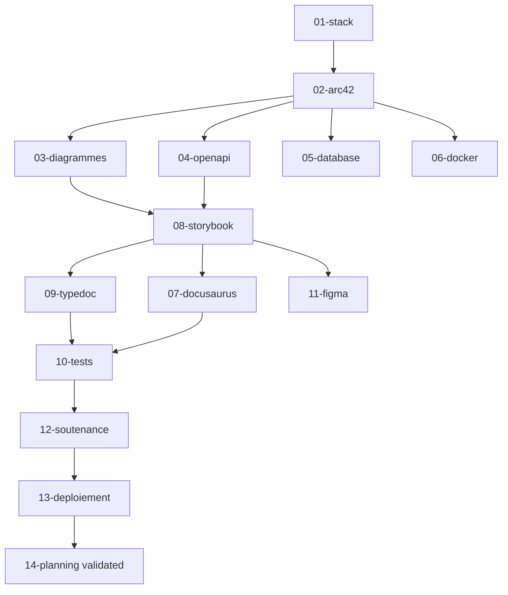

# Planning 30 jours

[← Retour au README](./README.md)

---

## État d'avancement

> **Dernière mise à jour** : 22 janvier 2025

| Checkpoint | Statut | Notes |
|------------|--------|-------|
| Phase A : Fondations (J1-J8) | ✅ Terminé | MkDocs + Arc42 + Diagrammes |
| Phase B : Backend (J9-J11) | ✅ Terminé | OpenAPI + Database + Docker |
| Phase C : Frontend (J12-J17) | ✅ Terminé | Arc42 éclaté en 32 fichiers hiérarchiques |
| Phase D : Qualité (J28-J29) | ⏳ Non démarré | Vitest + Playwright |
| Phase E : Finalisation (J18-J23, J30) | ⏳ Non démarré | Soutenance + Déploiement |

**Progression globale** : 🔄 **~60%** (Phases A, B et C terminées)

### Restructuration Arc42 (22 janvier 2025)

| Section | Fichiers éclatés |
|---------|------------------|
| 05-building-blocks | `index.md`, `frontend.md`, `backend.md`, `database.md` |
| 06-runtime | `index.md`, `authentication.md`, `search.md`, `messaging.md`, `error-handling.md` |
| 08-crosscutting | `index.md`, `authentication.md`, `validation.md`, `error-handling.md`, `logging.md`, `security.md`, `i18n.md` |
| 09-decisions | `index.md` + 9 ADRs individuels (001-nextjs à 009-mock-to-api) |
| 10-quality | `index.md`, `scenarios.md`, `testing.md`, `accessibility.md`, `monitoring.md` |

**Bénéfices** : Navigation granulaire via menus déroulants dans MkDocs Material

---

## Vue d'ensemble

```plaintext
Semaine 1 (J1-J7)     : Fondations + Arc42
Semaine 2 (J8-J14)    : API + BDD + Storybook
Semaine 3 (J15-J21)   : Docusaurus + Fiches
Semaine 4 (J22-J27)   : Figma + TypeDoc
Semaine 5 (J28-J30)   : Tests + Deploiement
```

---

## Planning detaille

| Jour | Tache | Livrable |
| ---- | ----- | -------- |
| **J1** | Setup MkDocs + structure Arc42 | `docs/` initialise |
| **J2** | Arc42 sections 1-2 (Intro, Contraintes) | 2 sections completes |
| **J3** | Arc42 section 3 (Contexte) + C4 Context | Diagramme C4 |
| **J4** | Arc42 section 4-5 (Strategie, Building Blocks) | C4 Container |
| **J5** | Arc42 section 6 (Runtime) + sequences | 3 diagrammes sequence |
| **J6** | Arc42 section 7 (Deploiement) + docker-compose-viz | Infra documentee |
| **J7** | Arc42 sections 8-9 (Transverse, ADRs) | 5 ADRs |
| **J8** | Arc42 sections 10-12 (Qualite, Risques, Glossaire) | Arc42 complet |
| **J9** | OpenAPI specification complete | `openapi.yaml` |
| **J10** | Swagger UI integration + tests | API documentee |
| **J11** | Prisma ERD + SchemaSpy + documentation BDD | Schema documente |
| **J12** | Storybook setup + atoms (8 composants) | 15 stories |
| **J13** | Storybook molecules (6 composants) | 12 stories |
| **J14** | Storybook organisms (SearchPage, etc.) | 10 stories |
| **J15** | Docusaurus setup + structure Diataxis | `user-docs/` initialise |
| **J16** | Tutorials (4 articles) | Section Tutorials |
| **J17** | How-to guides (4 articles) | Section How-to |
| **J18** | Explanation + Reference | 2 sections completes |
| **J19** | Fiche 1-2 (Architecture, Atomic Design) | 2 fiches |
| **J20** | Fiche 3-4 (useSearch, Auth flow) | 2 fiches |
| **J21** | Fiche 5-6 (Messaging, Meilisearch) | 2 fiches |
| **J22** | Q&R Jury (20 questions) | `qr-jury.md` |
| **J23** | Demo script + rehearsal | `demo-script.md` |
| **J24** | Figma: import tokens + composants cles | Design system |
| **J25** | TypeDoc: setup + P1 (useSearch, useMessaging, api-client) | TSDoc P1 complete |
| **J26** | TypeDoc: P2-P4 (hooks restants, utils, validation) | ~25 fichiers documentes |
| **J27** | Figma: finalisation composants | Design system complet |
| **J28** | Tests: Vitest setup + hooks (useSearch, useMessaging) | Tests unitaires hooks |
| **J29** | Tests: Composants (SearchBar, ProfileCard, AuthForm) | Tests composants |
| **J30** | Tests: Playwright E2E + Deploiement Vercel | 4 URLs live + tests green |

---

## Checkpoints

| Jour | Checkpoint | Validation |
| ---- | ---------- | ---------- |
| J7 | Arc42 80% complete | Relecture equipe |
| J14 | Storybook fonctionnel | Demo interne |
| J21 | Toute la doc ecrite | Relecture finale |
| J26 | TypeDoc complete | API reference prete |
| J30 | Tests + Deploiement OK | 4 URLs + tests green |

---

## Planning par phases

### Phase A : Fondations (J1-J8) - 8 jours

| Tâche | Fichier stratégie | Jours | Livrables |
| ----- | ----------------- | ----- | --------- |
| Setup MkDocs + Arc42 | 02-arc42-mkdocs.md | J1-J8 | 12 sections Arc42 |
| Diagrammes C4/Mermaid | 03-diagrammes.md | J3-J5 | 6+ diagrammes |
| Stack documentation | 01-stack.md | J1 | Choix validés |

### Phase B : Backend (J9-J11) - 3 jours

| Tâche | Fichier stratégie | Jours | Livrables |
| ----- | ----------------- | ----- | --------- |
| OpenAPI specification | 04-api-openapi.md | J9-J10 | 31 endpoints documentés |
| Database documentation | 05-database.md | J11 | ERD + SchemaSpy |
| Docker documentation | 06-docker.md | J11 | Infra documentée |

### Phase C : Frontend (J12-J17) - 6 jours

| Tâche | Fichier stratégie | Jours | Livrables |
| ----- | ----------------- | ----- | --------- |
| Storybook setup + stories | 08-storybook.md | J12-J14 | 53 composants |
| Docusaurus + Diataxis | 07-docusaurus-diataxis.md | J15-J17 | Guide utilisateur |
| TypeDoc + TSDoc | 09-typedoc.md | J25-J26 | API reference |
| Figma tokens | 11-figma.md | J24, J27 | Design system |

### Phase D : Qualité (J15-J17, J28-J29) - 5 jours

| Tâche | Fichier stratégie | Jours | Livrables |
| ----- | ----------------- | ----- | --------- |
| Vitest setup + tests | 10-tests.md | J28 | Tests unitaires |
| Playwright E2E | 10-tests.md | J29-J30 | 4 parcours E2E |

### Phase E : Finalisation (J18-J23, J30) - 7 jours

| Tâche | Fichier stratégie | Jours | Livrables |
| ----- | ----------------- | ----- | --------- |
| Fiches soutenance | 12-soutenance.md | J18-J23 | 6 fiches + Q&R |
| Déploiement Vercel | 13-deploiement.md | J30 | 3 URLs live |

---

## Répartition par semaine

### Semaine 1 (J1-J7)

```plaintext
Lun  J1  │ Setup MkDocs + structure Arc42
Mar  J2  │ Arc42 sections 1-2 (Intro, Contraintes)
Mer  J3  │ Arc42 section 3 (Contexte) + C4 Context
Jeu  J4  │ Arc42 section 4-5 (Stratégie, Building Blocks)
Ven  J5  │ Arc42 section 6 (Runtime) + séquences
Sam  J6  │ Arc42 section 7 (Déploiement) + docker-compose-viz
Dim  J7  │ Arc42 sections 8-9 (Transverse, ADRs) ★ CHECKPOINT
```

### Semaine 2 (J8-J14)

```plaintext
Lun  J8  │ Arc42 sections 10-12 (Qualité, Risques, Glossaire)
Mar  J9  │ OpenAPI specification
Mer  J10 │ Swagger UI integration + tests
Jeu  J11 │ Prisma ERD + Database documentation
Ven  J12 │ Storybook setup + atoms (15 composants)
Sam  J13 │ Storybook molecules (8 composants)
Dim  J14 │ Storybook organisms (30 composants) ★ CHECKPOINT
```

### Semaine 3 (J15-J21)

```plaintext
Lun  J15 │ Docusaurus setup + structure Diataxis
Mar  J16 │ Tutorials (4 articles)
Mer  J17 │ How-to guides (6 articles)
Jeu  J18 │ Explanation + Reference + Fiches 1-2
Ven  J19 │ Fiches 3-4 (useSearch, Auth flow)
Sam  J20 │ Fiches 5-6 (Messaging, Meilisearch)
Dim  J21 │ Relecture finale toute documentation ★ CHECKPOINT
```

### Semaine 4 (J22-J28)

```plaintext
Lun  J22 │ Q&R Jury (20+ questions)
Mar  J23 │ Demo script + rehearsal
Mer  J24 │ Figma: import tokens + composants clés
Jeu  J25 │ TypeDoc: setup + P1 hooks
Ven  J26 │ TypeDoc: P2-P4 (lib, validation) ★ CHECKPOINT
Sam  J27 │ Figma: finalisation composants
Dim  J28 │ Tests: Vitest setup + hooks
```

### Semaine 5 (J29-J30)

```plaintext
Lun  J29 │ Tests: Composants + Playwright setup
Mar  J30 │ Tests E2E + Déploiement Vercel ★ FINAL
```

---

## Dépendances critiques



---

## Plan d'action détaillé

### Phase 1 : Initialisation planning (J0 - 1h)

| Étape | Action | Livrable | Validation |
| ----- | ------ | -------- | ---------- |
| 1.1 | Valider planning avec équipe | Accord équipe | Tous OK |
| 1.2 | Assigner responsables par tâche | Matrice RACI | Rôles clairs |
| 1.3 | Créer calendrier partagé | Google Calendar | Invites envoyées |
| 1.4 | Configurer rappels checkpoints | Alertes | Notifications actives |

### Phase 2 : Suivi quotidien (J1-J30)

| Étape | Action | Livrable | Validation |
| ----- | ------ | -------- | ---------- |
| 2.1 | Daily standup 15min | Blocages identifiés | Réunion tenue |
| 2.2 | Mise à jour avancement | Tableau Kanban | Statuts à jour |
| 2.3 | Documentation des décisions | ADRs si besoin | Traçabilité |
| 2.4 | Escalade si retard | Plan de rattrapage | Actions définies |

### Phase 3 : Checkpoints (J7, J14, J21, J26, J30)

| Étape | Action | Livrable | Validation |
| ----- | ------ | -------- | ---------- |
| 3.1 | Revue des livrables | Liste complète | Checklist vérifiée |
| 3.2 | Démo interne | Présentation équipe | Feedback collecté |
| 3.3 | Ajustement planning si nécessaire | Planning révisé | Équipe informée |
| 3.4 | Validation Go/No-Go | Décision documentée | Accord formel |

---

## Dépendances

### Requiert (inputs)

| Dépendance | Fichier source | Statut |
| ---------- | -------------- | ------ |
| Tous les fichiers stratégie | 01-14 | À compléter |
| Équipe disponible | Ressources humaines | À vérifier |
| Outils configurés | MkDocs, Storybook, etc. | À installer |

### Bloque (outputs)

| Fichier dépendant | Raison |
| ----------------- | ------ |
| 00-plan-action-global.md | Consolidation planning |
| Soutenance | Date fixe J30+ |

---

## Critères de validation

### Obligatoires (must-have)

- [ ] Tous les checkpoints respectés (J7, J14, J21, J26, J30)
- [ ] 0 tâche en retard de plus de 2 jours
- [ ] 4 URLs de documentation live à J30
- [ ] Tests green en CI
- [ ] Équipe prête pour soutenance

### Optionnels (nice-to-have)

- [ ] Buffer de 2 jours avant soutenance
- [ ] Documentation 100% complète (pas 80%)
- [ ] Zéro dette technique documentée

---

## Ressources nécessaires

### Équipe

| Rôle | Responsabilité principale | Backup |
| ---- | ------------------------- | ------ |
| Lead Doc | Arc42, coordination | Membre 2 |
| Frontend Dev | Storybook, composants | Membre 3 |
| Backend Dev | API, BDD, Docker | Lead Doc |
| DevOps | CI/CD, déploiement | Frontend Dev |

### Outils de suivi

- GitHub Projects (Kanban)
- Google Calendar (Planning)
- Slack/Discord (Communication)
- Google Meet (Daily standups)

### Temps estimé global

| Phase | Jours | Heures estimées |
| ----- | ----- | --------------- |
| Phase A (Fondations) | 8 | 40h |
| Phase B (Backend) | 3 | 15h |
| Phase C (Frontend) | 6 | 30h |
| Phase D (Qualité) | 5 | 25h |
| Phase E (Finalisation) | 7 | 35h |
| **Total** | **30** | **~145h** |

---

## Risques spécifiques

| Risque | Impact | Mitigation |
| ------ | ------ | ---------- |
| Membre malade | Retard tâches | Chaque tâche a un backup |
| Outil qui casse | Blocage | Documentation des workarounds |
| Scope creep | Dépassement | Strict suivi du planning |
| Dépendance non résolue | Blocage en cascade | Anticiper avec graph dépendances |
| Burnout équipe | Qualité réduite | Respecter les pauses, week-ends |

---

## Fichiers à créer (checklist finale)

```plaintext
docs/documentation-strategy/
├── [ ] 00-plan-action-global.md    # Consolidation (à créer)
│
Outils de suivi/
├── [ ] GitHub Project              # Board Kanban
├── [ ] Google Calendar             # Planning partagé
└── [ ] Slack Channel               # #doc-strategy
```

**Total** : 1 fichier + 3 outils à configurer

---

## Navigation

| Précédent | Suivant |
| --------- | ------- |
| [13-deploiement](./13-deploiement.md) | [← Retour au README](./README.md) |
