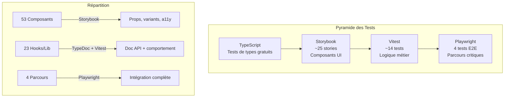

# Fiche: Stratégie de Tests Diversifiée

## En une phrase

Approche où chaque outil teste ce qu'il fait le mieux, réduisant de 50% l'effort tout en améliorant la couverture.

## Schéma mental



## Points clés

1. **Pas de tests Vitest pour les composants** : Storybook les documente ET les teste (visuels, interactions, accessibilité)

2. **Vitest uniquement pour la logique métier** : Hooks avec comportement async (useSearch, useMessaging), fonctions pures (dateTime.utils), schemas Zod

3. **4 tests E2E suffisent** : Auth, Search, Messaging, Profile couvrent l'intégration complète

4. **TypeScript = tests gratuits** : Les types valident la structure, pas besoin de tests pour ça

5. **Réduction de 50% de l'effort** : ~44 fichiers au lieu de ~90, même couverture fonctionnelle

## Code essentiel

```typescript
// vitest.config.ts - Exclure explicitement les composants
export default defineConfig({
  test: {
    include: [
      'src/hooks/**/*.test.ts',  // ✅ Hooks
      'src/lib/**/*.test.ts',    // ✅ Lib
    ],
    exclude: [
      'src/components/**',       // ❌ Pas de tests composants
    ],
  },
});
```

## Questions probables du jury

### Q1: "Pourquoi ne pas tester les composants avec Vitest ?"

**R**: "Storybook fait tout ce que Vitest ferait, en mieux :
- **addon-interactions** pour les clics et saisies
- **addon-a11y** pour l'accessibilité WCAG
- **Chromatic** pour la régression visuelle
- **Autodocs** pour la documentation

Dupliquer avec Vitest serait du travail redondant sans valeur ajoutée."

### Q2: "Comment garantissez-vous que tout fonctionne ensemble ?"

**R**: "Les 4 tests E2E Playwright simulent de vrais parcours utilisateur : inscription, recherche, messagerie, profil. Ils valident l'intégration de tous les composants, hooks et API ensemble. C'est plus fiable que des centaines de tests unitaires isolés."

### Q3: "N'est-ce pas risqué d'avoir peu de tests ?"

**R**: "Au contraire. Notre approche donne :
- **100% des composants** documentés et testés visuellement (Storybook)
- **80%+ de coverage** sur la logique métier critique (Vitest)
- **100% des parcours critiques** couverts (Playwright)
- **Tests d'accessibilité** automatiques (addon-a11y)

C'est une couverture supérieure à 'tout tester avec Jest', avec moins d'effort de maintenance."

### Q4: "Comment avez-vous décidé de cette stratégie ?"

**R**: "En analysant notre architecture :
- 53 composants Atomic Design → Storybook est fait pour ça
- 23 fichiers hooks/lib → Logique métier à tester avec Vitest
- 4 parcours utilisateur critiques → E2E avec Playwright

Chaque outil est optimisé pour son usage. C'est documenté dans l'ADR-010."

## Liens

- ADR : [ADR-010 Testing Strategy](../../documentation-implementation/arc42/09-decisions/010-testing-strategy.md)
- Plan Storybook : [08-storybook.md](../../documentation-strategy/08-storybook.md)
- Plan TypeDoc : [09-typedoc.md](../../documentation-strategy/09-typedoc.md)
- Plan Tests : [10-tests.md](../../documentation-strategy/10-tests.md)

## Métriques à retenir

| Métrique | Valeur |
|----------|--------|
| Réduction effort | **-50%** |
| Stories Storybook | ~25 |
| Tests Vitest | ~14 |
| Tests E2E | 4 |
| Coverage composants | 100% (Storybook) |
| Coverage logique métier | ≥80% (Vitest) |
